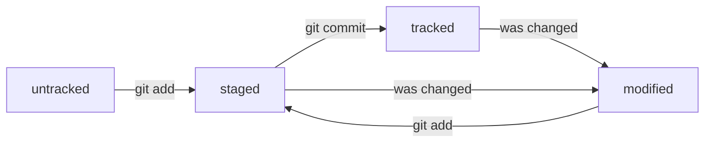

<<<<<<< HEAD

=======
git init — инициализируй директорию для нового проекта;  
git clone https://address — клонируй репозиторий по ссылке;  
git status — отобрази текущее состояние репозитория;  
git add . — добавь все изменённые и неотслеживаемые файлы в
отслеживаемые;  
git add file.cpp — добавь в отслеживаемые файл file.cpp ;  
git commit -m “new feature” — сделай коммит с сообщением new feature ;  
git push — отправь все закоммитченные изменения на удалённый сервер;  
git pull --rebase — забери все изменения с удалённого сервера и обнови
текущую ветку;  
git fetch — забери все изменения с удалённого сервера, но не обновляй
текущую ветку;  
git checkout branch_name — переключись на ветку branch_name ;  
git checkout -b new_branch — переключись на ветку branch_name , а если её не
существует, создай её локально;  
git push -u origin new_branch — создай на удалённом сервере новую ветку с
названием new_branch ;  
git merge branch_name_to_merge_from — объедини текущую ветку с веткой
branch_name_to_merge_from   
>>>>>>> b183bd99de64e889faa284909f7ddb63a23be04c
